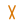

---
hide:
  - navigation
  - toc
description: "MemoryMesh -- free, open-source AI memory library. Give any LLM persistent memory in 3 lines of Python. Zero dependencies, fully local, works with Claude, GPT, Gemini, Ollama. The SQLite of AI Memory."
---

<!-- Hero -->
<div class="hero-section">
  <h1>MemoryMesh</h1>
  <p class="hero-sub">The SQLite of AI Memory. Persistent, intelligent memory for any LLM in three lines of code.</p>
  <div class="hero-badges">
    <span class="hero-badge accent">MIT License</span>
    <span class="hero-badge accent">100% Free</span>
    <span class="hero-badge">Zero Dependencies</span>
    <span class="hero-badge">Fully Local</span>
    <span class="hero-badge">Any LLM</span>
  </div>
  <div class="hero-install">pip install memorymesh</div>
  <div class="hero-buttons">
    <a href="getting-started/" class="md-button md-button--primary">Get Started</a>
    <a href="https://github.com/sparkvibe-io/memorymesh" class="md-button">GitHub</a>
  </div>
</div>

<!-- Stats -->
<div class="mm-section" style="padding-top:0">
  <div class="stats-row">
    <div class="stat-card">
      <span class="stat-number">Instant</span>
      <span class="stat-label">Blazing fast storage</span>
    </div>
    <div class="stat-card">
      <span class="stat-number">~60x</span>
      <span class="stat-label">Fewer tokens per session</span>
    </div>
    <div class="stat-card">
      <span class="stat-number">Zero</span>
      <span class="stat-label">Dependencies to install</span>
    </div>
    <div class="stat-card">
      <span class="stat-number">3 Lines</span>
      <span class="stat-label">To get started</span>
    </div>
  </div>
</div>

<!-- Quick code -->
<div class="mm-section">
  <h2>Three Lines. Persistent Memory.</h2>
</div>

```python
from memorymesh import MemoryMesh

memory = MemoryMesh()
memory.remember("User prefers Python and dark mode")
results = memory.recall("What does the user prefer?")
```

<div class="mm-section" style="padding-top:0.5rem">
  <p>No servers. No cloud. No API keys. Everything stays on your machine in SQLite.</p>
</div>

<!-- Works With -->
<div class="mm-section">
  <h2>Works With Everything</h2>
  <div class="chip-grid">
    <span class="icon-chip"> Claude Code</span>
    <span class="icon-chip"> Claude Desktop</span>
    <span class="icon-chip"> GPT-4</span>
    <span class="icon-chip"> Gemini CLI</span>
    <span class="icon-chip"> Cursor</span>
    <span class="icon-chip"> Windsurf</span>
    <span class="icon-chip"> Ollama</span>
    <span class="icon-chip"> Codex CLI</span>
    <span class="icon-chip"> Llama</span>
    <span class="icon-chip"> Mistral</span>
    <span class="icon-chip"> GitHub Copilot</span>
    <span class="icon-chip"> Any MCP Client</span>
  </div>
</div>

<div class="mm-section" style="padding-top:0" markdown>

=== "Claude Code"

    ```json
    { "mcpServers": { "memorymesh": { "command": "memorymesh-mcp" } } }
    ```

=== "Gemini CLI"

    ```json
    { "mcpServers": { "memorymesh": { "command": "memorymesh-mcp" } } }
    ```

=== "Codex CLI"

    ```json
    { "mcpServers": { "memorymesh": { "command": "memorymesh-mcp" } } }
    ```

=== "Cursor"

    ```json
    { "mcpServers": { "memorymesh": { "command": "memorymesh-mcp" } } }
    ```

=== "Python"

    ```python
    from memorymesh import MemoryMesh
    memory = MemoryMesh(embedding="ollama")
    memory.remember("User prefers dark mode")
    ```

</div>

<!-- Why -->
<div class="mm-section">
  <h2>Why MemoryMesh?</h2>
  <p>AI tools have no memory. Existing solutions are heavy. MemoryMesh is different.</p>
  <div class="problem-grid">
    <div class="problem-card">
      <h4>Sessions Start Blank</h4>
      <p>You told Claude your coding style yesterday. Today it asks again.</p>
    </div>
    <div class="problem-card">
      <h4>Decisions Are Lost</h4>
      <p>You decided JWT for auth. Next session, the AI suggests cookies.</p>
    </div>
    <div class="problem-card">
      <h4>Mistakes Repeat</h4>
      <p>Fixed a bug Monday. Friday, the AI introduces the same bug.</p>
    </div>
    <div class="problem-card">
      <h4>Tools Are Siloed</h4>
      <p>What you teach Claude stays in Claude. Gemini and Cursor know nothing.</p>
    </div>
  </div>
  <table>
    <thead>
      <tr><th>Solution</th><th>Approach</th><th>Trade-off</th></tr>
    </thead>
    <tbody>
      <tr><td><strong>Mem0</strong></td><td>SaaS</td><td>Cloud required, data leaves machine, ongoing costs</td></tr>
      <tr><td><strong>Letta</strong></td><td>Agent framework</td><td>Heavy lock-in, complex setup</td></tr>
      <tr><td><strong>Zep</strong></td><td>Memory server</td><td>Requires PostgreSQL + Docker</td></tr>
      <tr><td><strong>MemoryMesh</strong></td><td>Embeddable library</td><td>Zero deps. SQLite. Free forever.</td></tr>
    </tbody>
  </table>
</div>

<!-- What you get -->
<div class="mm-section">
  <h2>What You Get</h2>
  <div class="solution-grid">
    <div class="solution-card">
      <h4>Works with Any LLM</h4>
      <p>Claude, GPT, Gemini, Llama, Ollama, Mistral. A memory layer, not a framework.</p>
    </div>
    <div class="solution-card">
      <h4>Fully Local & Private</h4>
      <p>All data in SQLite on your machine. No telemetry, no cloud, no data collection.</p>
    </div>
    <div class="solution-card">
      <h4>Cross-Tool Memory</h4>
      <p>Sync to Claude Code, Codex CLI, and Gemini CLI. One store, every tool.</p>
    </div>
    <div class="solution-card">
      <h4>Free & Open Source</h4>
      <p>MIT licensed. No paid tiers, no subscriptions. Built for humanity.</p>
    </div>
  </div>
</div>

<!-- Features -->
<div class="mm-section">
  <h2>Features</h2>
  <div class="feature-grid">
    <div class="feature-card">
      <h3>Simple API</h3>
      <p>remember(), recall(), forget(). No boilerplate.</p>
    </div>
    <div class="feature-card">
      <h3>Semantic Search</h3>
      <p>Find by meaning, not keywords. Ollama or local embeddings.</p>
    </div>
    <div class="feature-card">
      <h3>Memory Categories</h3>
      <p>Auto-categorize and route to the right scope.</p>
    </div>
    <div class="feature-card">
      <h3>MCP Server</h3>
      <p>Built-in for Claude, Cursor, Windsurf, Gemini.</p>
    </div>
    <div class="feature-card">
      <h3>Encrypted Storage</h3>
      <p>Encrypt at rest. Zero external deps.</p>
    </div>
    <div class="feature-card">
      <h3>Auto-Compaction</h3>
      <p>Transparent dedup. Like SQLite auto-vacuum.</p>
    </div>
    <div class="feature-card">
      <h3>Session Context</h3>
      <p>User profile, guardrails, project state in one call.</p>
    </div>
    <div class="feature-card">
      <h3>Time-Based Decay</h3>
      <p>Recent memories rank higher. Stale ones fade.</p>
    </div>
    <div class="feature-card">
      <h3>Episodic Memory</h3>
      <p>Group by session. Recall with conversation context.</p>
    </div>
    <div class="feature-card">
      <h3>Pin Support</h3>
      <p>Pin critical memories. Never decay, always top-ranked.</p>
    </div>
    <div class="feature-card">
      <h3>Privacy Guard</h3>
      <p>Auto-detect and redact secrets before storing.</p>
    </div>
    <div class="feature-card">
      <h3>Contradiction Detection</h3>
      <p>Catch conflicting facts. Keep, update, or skip.</p>
    </div>
    <div class="feature-card">
      <h3>Retrieval Filters</h3>
      <p>Filter by category, importance, time range, metadata.</p>
    </div>
    <div class="feature-card">
      <h3>Web Dashboard</h3>
      <p>Browse and search memories in your browser.</p>
    </div>
    <div class="feature-card">
      <h3>Evaluation Suite</h3>
      <p>Quality and adversarial tests for recall accuracy.</p>
    </div>
  </div>
</div>

<!-- Token savings -->
<div class="mm-section">
  <h2>Saves You Money</h2>
  <p>Without memory, token costs grow linearly every turn. MemoryMesh keeps them flat.</p>
  <table>
    <thead>
      <tr><th>Turn</th><th>Without Memory</th><th>With MemoryMesh</th></tr>
    </thead>
    <tbody>
      <tr><td>5</td><td>~1,500 tokens</td><td>~400 tokens</td></tr>
      <tr><td>20</td><td>~10,000 tokens</td><td>~450 tokens</td></tr>
      <tr><td>50</td><td>~30,000 tokens</td><td>~500 tokens</td></tr>
    </tbody>
  </table>
</div>

<!-- Community & Subscribe -->
<div class="mm-section">
  <h2>Community</h2>
  <p>MemoryMesh is open source and built in the open. Get involved.</p>
  <div class="community-row">
    <a href="https://github.com/sparkvibe-io/memorymesh" class="community-card">
      <span class="cc-icon">&#x2b50;</span>
      <h4>Star on GitHub</h4>
      <p>Show support and get release updates</p>
    </a>
    <a href="https://github.com/sparkvibe-io/memorymesh/issues/new?template=feature_request.md" class="community-card">
      <span class="cc-icon">&#x1f4a1;</span>
      <h4>Request a Feature</h4>
      <p>Tell us what you need</p>
    </a>
    <a href="https://github.com/sparkvibe-io/memorymesh/issues/new?template=bug_report.md" class="community-card">
      <span class="cc-icon">&#x1f41b;</span>
      <h4>Report a Bug</h4>
      <p>Help us fix it</p>
    </a>
  </div>
  <div class="subscribe-row">
    <a href="mailto:support@sparkvibe.io?subject=Subscribe%20to%20MemoryMesh%20updates" class="subscribe-btn primary">&#x2709;&#xfe0f; Subscribe for Updates</a>
    <a href="https://github.com/sparkvibe-io/memorymesh/issues" class="subscribe-btn">&#x1f4ac; Discussions</a>
    <a href="contributing/" class="subscribe-btn">&#x1f91d; Contribute</a>
  </div>
</div>

<!-- CTA -->
<div class="cta-section">
  <h2>Give Your AI a Memory</h2>
  <div class="hero-install">pip install memorymesh</div>
  <div class="hero-buttons">
    <a href="getting-started/" class="md-button md-button--primary">Get Started</a>
    <a href="api/" class="md-button">API Reference</a>
    <a href="https://github.com/sparkvibe-io/memorymesh" class="md-button">GitHub</a>
  </div>
</div>
